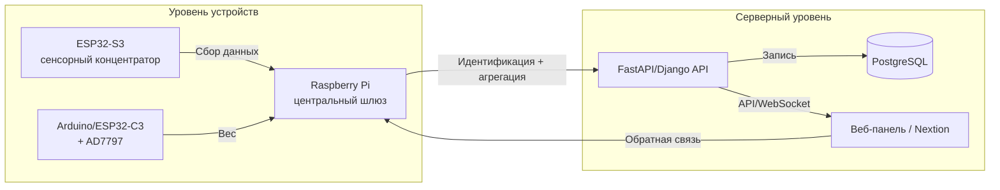
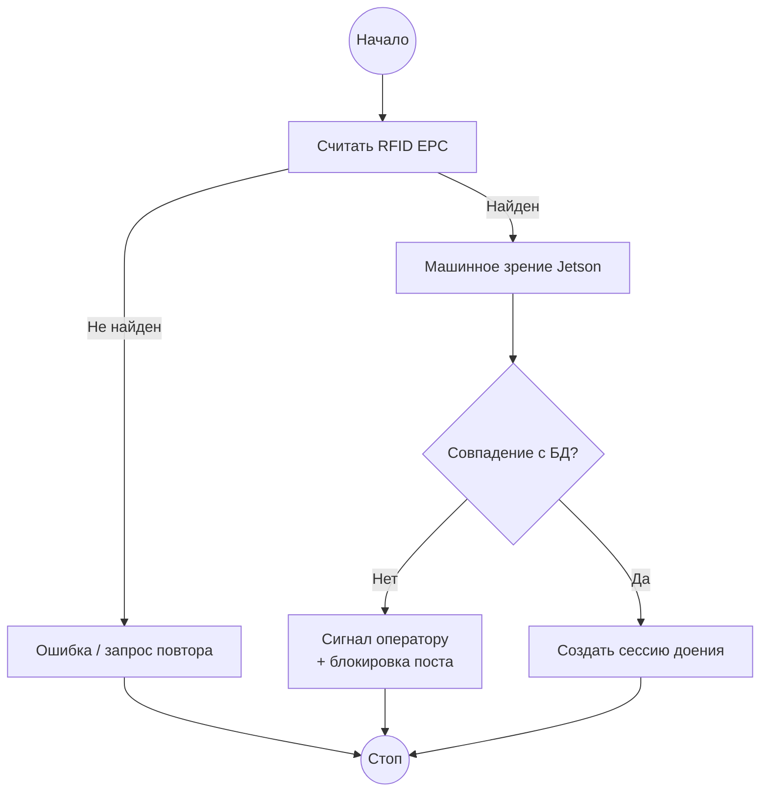
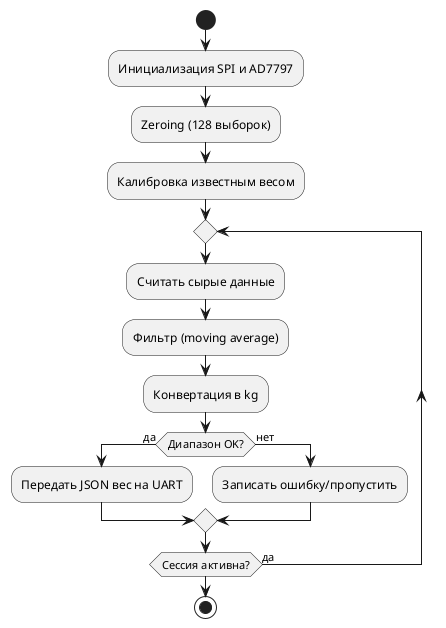
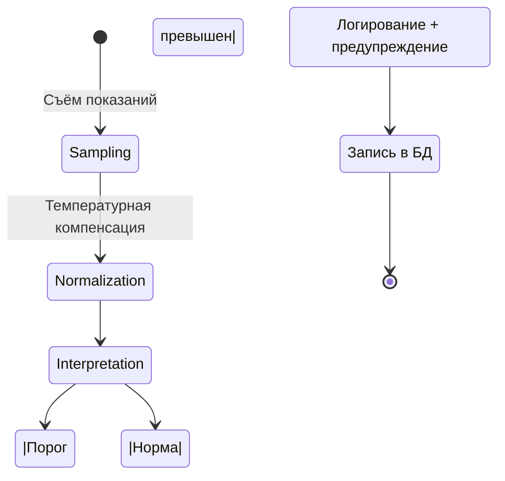
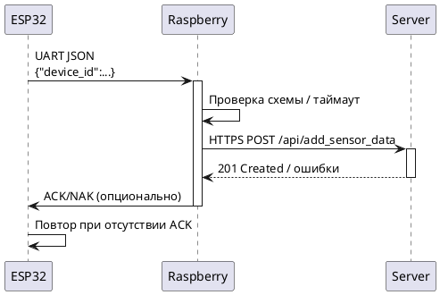
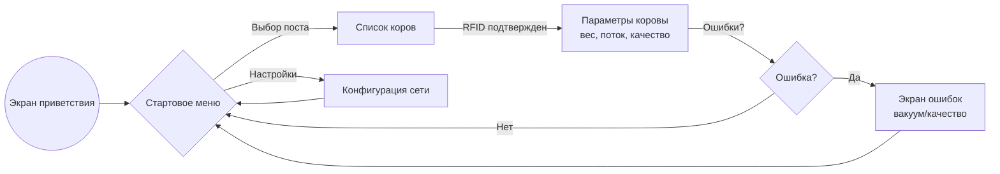
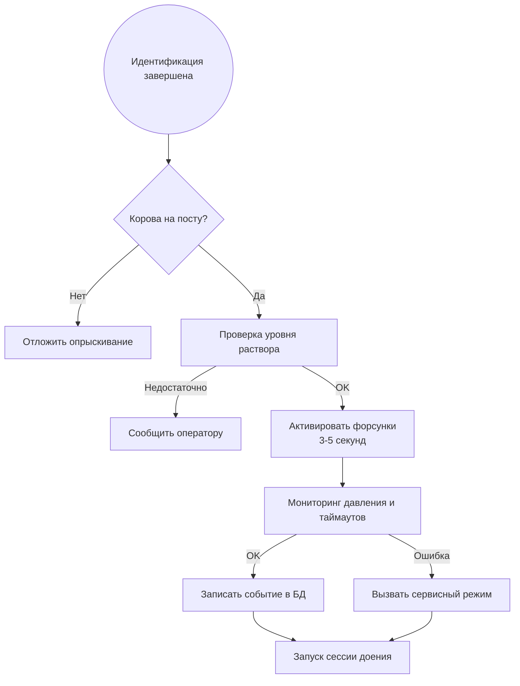

# Блок-схемы интеллектуального модуля Milkwarden

Ниже приведены шесть схем, описывающих ключевые части системы. Каждая схема сопровождается пояснением о назначении и месте интеграции в общий проект.

---

## 1. Общая архитектура
Схема демонстрирует основной поток данных: от сенсорных узлов (ESP32 и Arduino/AD7797) через Raspberry Pi к серверу, БД и интерфейсам оператора. Она помогает архитекторам и разработчикам видеть полный путь телеметрии и быстро соотнести элементы с файлами `esp32_sensor_reader.py`, `ad7797_reader.ino`, `raspberry_data_router.py` и `server_api.py`.

---

## 2. Алгоритм идентификации коровы
Схема показывает, как данные RFID и машинного зрения объединяются для подтверждения личности коровы. Она интегрируется с серверной БД (`cow`, `vision_matches`) и используется Raspberry для принятия решения о запуске сессии.

---

## 3. Алгоритм измерения веса
Поток повторяет шаги zeroing → filtering → calibration → transmission, что напрямую связано с реализацией в `ad7797_reader.ino`. Схема нужна инженерам по встраиваемым системам для проверки логики обработки тензодатчиков.

---

## 4. Контроль качества молока
Эта диаграмма объединяет показания мутности, электропроводности и температуры и описывает принятие решения о тревоге. Она соотносится с `esp32_sensor_reader.py` и серверной логикой анализа качества.

---

## 5. Обмен Raspberry ↔ ESP32 ↔ Server
Диаграмма описывает протокол обмена, формат JSON, таймауты и политику повторов для `raspberry_data_router.py`. Даже без запуска кода можно понять, как реализованы QoS и защитные механизмы.

---

## 6. Интерфейс Nextion
Flowchart отражает взаимодействия оператора со стартовым меню, выбором коровы, просмотром параметров и обработкой ошибок. Она связана с данными, приходящими из `server_api.py` и `raspberry_data_router.py`, которые питают UI.

---

## 7. Опрыскивание коровы до доения
Схема описывает гигиенический цикл после идентификации и до запуска измерений. Она встроена между блоками идентификации и измерения в архитектуре, а команды реализуются в Raspberry через расширение GPIO/RS-485. Логи операций идут в серверную БД для аудита.

---

## Как открыть диаграммы
- **Mermaid**: в VS Code достаточно расширения “Markdown Preview Mermaid Support” и просмотра `flowcharts.md`; GitHub отображает диаграммы напрямую, Obsidian — через плагин “Mermaid”.
- **PlantUML**: в VS Code — расширение “PlantUML” + Java, затем команда `PlantUML: Preview Current Diagram`; в IntelliJ IDEA — плагин “PlantUML Integration”; в браузере — https://www.plantuml.com/plantuml.
- **PNG экспорт**: после генерации изображений их можно открыть стандартными просмотрщиками (Eye of GNOME, Windows Photos) или вставить в отчёт `docs/Отчёт_20.11.2025.docx`.
